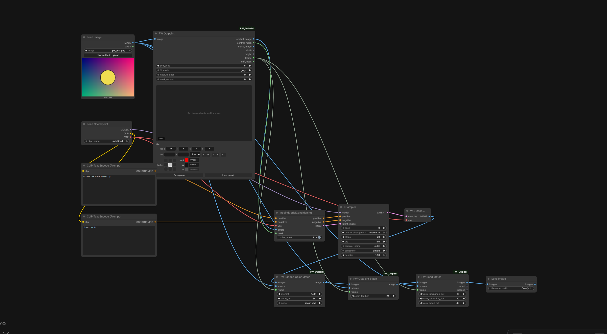
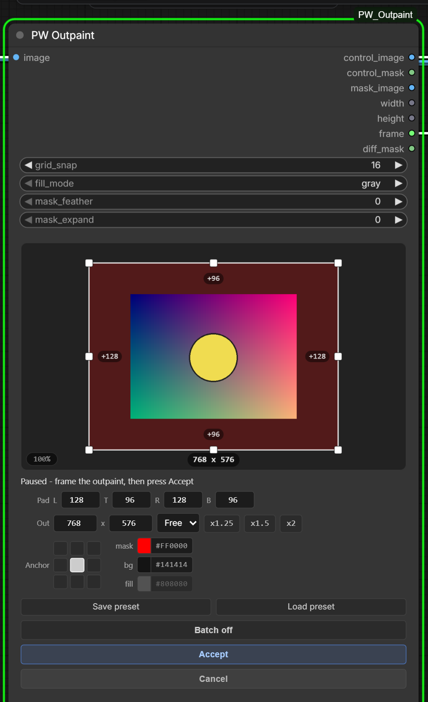
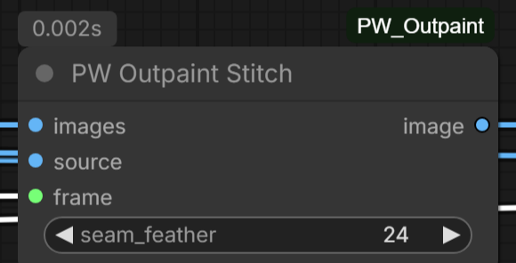
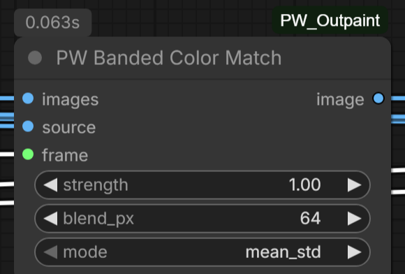
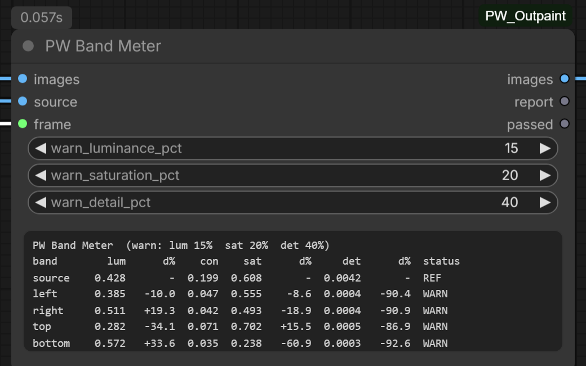

# PW Outpaint

An outpainting toolkit for ComfyUI, built around an interactive framing node: when your workflow reaches **PW Outpaint** it **pauses**, shows the live image on a canvas editor inside the node, and lets you drag the output frame out in any direction. Press **Accept** and the workflow continues with a control image, mask, and dimensions ready for any inpaint/outpaint pipeline - built with **Flux.2 Klein** in mind, but model-agnostic.

Four nodes, one shared frame model:

| Node | What it does |
|---|---|
| **PW Outpaint** | Interactive framing: control image, masks, dimensions, and the `frame` payload the other nodes consume |
| **PW Outpaint Stitch** | Pastes the untouched source back into the result, pixel-perfect |
| **PW Banded Color Match** | Color-corrects only the generated bands, fitted against the adjacent source |
| **PW Band Meter** | Numeric QC: flags bands whose brightness, saturation, or detail drifted from the source |

All four in one workflow - framing on the left, sampling in the middle, correct / stitch / meter on the way out:



## Features

- **Canvas editor on the node** - drag any edge or corner of the frame outward, scroll to zoom, drag outside the frame to pan, double-click to refit
- **Pause & approve** - the run waits while you frame the shot; Accept continues, Cancel stops the prompt cleanly (ComfyUI's own Cancel button works too)
- **Padding-based framing** - the frame is just four paddings (left/top/right/bottom) stored as real node widgets, so your last framing is saved with the workflow and the node even works **headless**: with no browser attached, the run continues after a short grace period using the stored paddings
- **Batch mode** - accept one frame with Batch on, and the rest of your queue reuses it automatically (paddings apply to any image size), then the node resets when the queue drains
- **Anchor grid** - a 3x3 anchor picks where the source sits in the output; aspect presets (1:1, 16:9, 9:16, 21:9, ...) and one-click x1.25 / x1.5 / x2 canvas scaling
- **Grid snap** - 8 / 16 / 32 / 64 px snapping (16 is right for Flux.2 Klein; 8 suits SD1.5/SDXL)
- **Fill modes** for the new area of the control image: `gray`, `solid_color` (pick any color), `edge_extend`, `mirror_blur`, `noise`
- **Mask feather & expand** - grow the mask into the original image and soften the seam for seamless blends
- **Presets** - save/load named framings to disk

## Installation

1. Open a terminal in your ComfyUI `custom_nodes` folder:

   ```
   cd ComfyUI/custom_nodes
   ```

2. Clone this repo:

   ```
   git clone https://github.com/Fablestarexpanse/PW_Outpaint.git
   ```

3. Restart ComfyUI. That's it - no extra dependencies, everything it needs ships with ComfyUI.

You'll find the nodes under **Add Node -> Promptwaffle** (or double-click and search "PW").

## Quick start

1. Connect any `IMAGE` output to PW Outpaint's `image` input.
2. Queue the workflow. When execution reaches the node, it pauses and the image appears in the editor.
3. Drag the frame edges outward (or use the aspect menu, scale buttons, anchor grid, or type paddings/output size directly). The tinted strips are the areas that will be generated.
4. Press **Accept**. The workflow continues.

> No browser open? After a short grace period the run continues using the paddings stored on the node - so the node is safe to use in API/headless pipelines too.

## Wiring it into a workflow

PW Outpaint doesn't generate anything itself - it prepares the three things every outpaint pipeline needs: the enlarged canvas (`control_image`), the mask saying where to generate (`control_mask`), and the output dimensions (`width`/`height`). Here's how to connect them.

### The general pattern (any inpaint-capable model)

```
LoadImage ---> PW Outpaint -+- control_image --> InpaintModelConditioning (pixels)
                           +- control_mask ---> InpaintModelConditioning (mask)
                           |                        | (+ positive, negative, VAE)
                           |                        v
                           |                    KSampler --> VAEDecode -+
                           +- frame -----------------------------------+
LoadImage (same image) ----+-------------------------------------------+
                           |                                           v
                           |                                  PW Outpaint Stitch --> SaveImage
```

1. `control_image` -> **InpaintModelConditioning** `pixels` (it VAE-encodes internally).
2. `control_mask` -> **InpaintModelConditioning** `mask`.
3. Sample with your model, decode, done. Add **PW Outpaint Stitch** at the end to keep the original pixels untouched.

### Flux.2 Klein (what the example workflow does)

Klein is an edit model, so the canvas also goes in as a reference:

```
PW Outpaint -+- control_image --> VAEEncode --> ReferenceLatent --> (conditioning chain)
             +- control_image --> InpaintModelConditioning (pixels)
             +- control_mask ---> InpaintModelConditioning (mask)
             +- width ----------> EmptyFlux2LatentImage (width)
             +- height ---------> EmptyFlux2LatentImage (height)

ReferenceLatent + InpaintModelConditioning --> KSampler (latent from EmptyFlux2LatentImage)
                                              +--> VAEDecode --> PW Outpaint Stitch --> SaveImage
```

Prompt tip for edit models: set `fill_mode` to `solid_color` with a bold color (e.g. red) and prompt something like *"Remove the red areas and extend the scene naturally."* - the model sees exactly where to work. `mask_image` is a ready-made visualization of that colored target if your workflow wants it as a separate reference.

A popular community variant of the same idea: set `solid_color` to pure white and pair it with cranpeach's uncrop LoRA ([Civitai model 2106308](https://civitai.com/models/2106308)), trigger phrase *"remove the white parts, use the image for context"*. `solid_color` is the fill mode built for exactly these techniques.

### The full-quality chain

All four nodes together, in order:

```
LoadImage --> PW Outpaint --> (sampling) --> VAEDecode
    |             |                              |
    |             +--- frame ---+                v
    |                           +--> PW Banded Color Match
    +---------------------------+--> PW Outpaint Stitch
                                +--> PW Band Meter --> SaveImage
```

Color-match the decoded canvas, stitch the clean source back in, meter the result. Each stage is optional; each one takes the same `source` image and `frame` payload.

### Differential Diffusion (softer repaint strength)

ComfyUI's core **DifferentialDiffusion** node reads a mask as per-pixel denoise strength. `diff_mask` is purpose-built for it: full strength over the new padding, a smooth ramp across the repaint ring (`mask_expand`), zero over the untouched interior.

```
Model --> DifferentialDiffusion --> KSampler
PW Outpaint - diff_mask ------> InpaintModelConditioning (noise_mask: true, mask input)
```

Use `diff_mask` as the mask for `InpaintModelConditioning` (with `noise_mask` enabled) while `DifferentialDiffusion` is patched onto the model - the seam region then regenerates gently instead of all-or-nothing.

Drag [`examples/pw_outpaint_klein9b.json`](examples/pw_outpaint_klein9b.json) into ComfyUI to see the core chain pre-wired.

---

# Node reference

## PW Outpaint

The heart of the pack. Receives an image, pauses the run, and opens a canvas editor on the node where you frame the outpaint: drag edges/corners out, pick an aspect, scale the canvas, or type exact paddings. On Accept it emits everything downstream nodes need. The frame is stored as four paddings, so it survives saving/loading the workflow and works headless via the API.



**In the full setup:** first node after your image loader - everything else (conditioning, latent size, color match, stitch, meter) hangs off its outputs, as in the [overview at the top](#pw-outpaint).

### Inputs

| Widget | Default | Notes |
|---|---|---|
| `image` | - | Source image (batch supported; the editor previews the first frame) |
| `grid_snap` | 16 | Snap step for the editor. Keep 16 for Flux.2 Klein / Qwen; 8 is fine for SD1.5/SDXL; 32/64 for models that prefer coarse blocks |
| `fill_mode` | gray | How the empty area of `control_image` is filled - see the table below |
| `mask_feather` | 0 | Gaussian feather radius (px) on the mask seam. The fully-new region always stays solid |
| `mask_expand` | 0 | Grows the mask into the original image so generation overlaps the seam - great for hiding hard edges |
| `pad_left/top/right/bottom` | 0 | The frame itself. Managed by the editor, but they're ordinary widgets - scriptable via the API |

Editor-only controls (not serialized as widgets): aspect presets, x1.25/x1.5/x2 scaling, the 3x3 anchor grid, mask/bg/fill colors, Batch toggle, and Save/Load preset.

### Fill modes

| Mode | What the new area looks like | When to use |
|---|---|---|
| `gray` | Flat 50% gray | Neutral default for inpaint-conditioned models |
| `solid_color` | The `fill` color from the editor | Edit models: bold color + "remove the red areas..." prompts, or white + uncrop LoRA |
| `edge_extend` | Edge pixels smeared outward | Gives the sampler real colors to build on; best all-round quality boost |
| `mirror_blur` | Mirrored image content, heavily blurred | Similar to edge_extend but with more structure; good for skies/water |
| `noise` | Gaussian noise around mid-gray | For models that dislike flat regions |

### Outputs

| Output | Type | What it is |
|---|---|---|
| `control_image` | IMAGE | The padded canvas with your image pasted in and the new area filled per `fill_mode` |
| `control_mask` | MASK | 1.0 where new content should be generated, 0.0 over the original image (after expand/feather) |
| `mask_image` | IMAGE | The mask rendered with your mask/bg colors (handy for edit-model prompts like "replace the red area") |
| `width` / `height` | INT | Final canvas dimensions |
| `frame` | PW_FRAME | The framing data (paddings + source size) - feed it to the other PW nodes |
| `diff_mask` | MASK | Gradient mask for **DifferentialDiffusion**: 1.0 over new padding, smooth ramp across the repaint ring, 0.0 over the untouched interior. If `mask_expand` is 0 the ramp falls back to `max(mask_feather, 8)` px so it is never a hard binary edge |

### Example configurations

**Flux.2 Klein / edit-model outpaint (the example workflow)**

| Setting | Value |
|---|---|
| `grid_snap` | 16 |
| `fill_mode` | `solid_color`, fill color red `#FF0000` |
| `mask_feather` / `mask_expand` | 0 / 0 |
| Prompt | "Remove the red areas and extend the scene naturally." |

**White-fill + uncrop LoRA (community technique)**

| Setting | Value |
|---|---|
| `fill_mode` | `solid_color`, fill color white `#FFFFFF` |
| LoRA | cranpeach's uncrop LoRA (Civitai 2106308) |
| Prompt | "remove the white parts, use the image for context" |

**Photo extension with an inpaint checkpoint (SDXL inpaint, Fooocus-style)**

| Setting | Value |
|---|---|
| `grid_snap` | 8 |
| `fill_mode` | `edge_extend` |
| `mask_feather` | 24 |
| `mask_expand` | 16 |

The expand lets generation overlap the photo edge; the feather hides the transition. Combine with denoise 0.85-1.0 on the sampler.

**Softest possible seam (Differential Diffusion)**

| Setting | Value |
|---|---|
| `fill_mode` | `edge_extend` |
| `mask_expand` | 32 |
| `mask_feather` | 16 |
| Extra wiring | `diff_mask` -> InpaintModelConditioning mask, `noise_mask: true`, model patched by DifferentialDiffusion |

The 32 px ring regenerates with gradually increasing strength, so the model re-paints the seam area gently instead of all-or-nothing.

**Headless / API run**

Set `pad_left/top/right/bottom` directly in the API prompt JSON (they are normal INT widgets). With no browser attached the node waits a short grace period, then continues with those paddings - no interaction required.

### Batch mode

Toggle **Batch on** before Accept and your framing is remembered. Every following run in the queue applies it automatically without pausing - paddings are size-agnostic, so mixed image sizes are fine. When the queue finishes, the node resets itself.

### Presets

**Save preset** stores the current paddings, anchor, and colors under a name. **Load preset** applies one. Presets live in the node's `presets/` folder as plain JSON.

## PW Outpaint Stitch

Sampling an outpaint pushes the *whole* canvas through the VAE, which subtly shifts every pixel - even the ones that were never masked. Stitch fixes that: it pastes your untouched original image back into its exact spot in the generated canvas, so the source stays pixel-perfect and only the new areas come from the sampler. It also auto-corrects small size drift if your sampler returned a slightly different resolution.



**In the full setup:** last image-processing stop before saving - it takes the decoded (and optionally color-matched) canvas, the original image, and PW Outpaint's `frame`.

### Inputs

| Input | Default | Notes |
|---|---|---|
| `images` | - | The generated outpaint (from VAEDecode, or from Banded Color Match) |
| `source` | - | The same image you fed into PW Outpaint |
| `frame` | - | PW Outpaint's `frame` output |
| `seam_feather` | 24 | How many px of the source edge blend into the generated area |

### Example configurations

| Scenario | `seam_feather` | Why |
|---|---|---|
| Default, most content | 24 | Invisible seam without visibly softening the source edge |
| Generation matches the source well | 0-8 | Hard paste; maximum source fidelity right up to the edge |
| Smooth gradients at the seam (sky, water, bokeh) | 48-96 | Wide blend hides any residual tone difference across the seam |
| Band color drifted and you are not using Banded Color Match | 64+ | The feather does double duty as a poor man's color blend |

## PW Banded Color Match

Frame-aware color correction. Global color matchers (fit one transform over the whole canvas) under-shoot outpaints, because most of the canvas is already-correct source content - the fit is dominated by pixels that need no change. This node corrects **only the generated bands**, each fitted against the strip of source content directly adjacent to it. Original pixels are never modified, at any strength. Wire it between VAEDecode and Stitch.



**In the full setup:** directly after VAEDecode, before the stitch - so the bands get corrected and the pristine source then covers the middle.

### Inputs

| Input | Default | Notes |
|---|---|---|
| `images` | - | The decoded canvas (pre-stitch) |
| `source` | - | The clean source image |
| `frame` | - | PW Outpaint's `frame` output |
| `strength` | 1.0 | 0 = off, 1 = apply the fitted correction, up to 2 = extrapolate past it |
| `blend_px` | 64 | Cross-fade width between overlapping band corrections in corners |
| `mode` | `mean_std` | `mean_std` = gentle statistics transfer (linear space); `histogram` = hard per-channel match |

### Example configurations

| Scenario | Settings | Why |
|---|---|---|
| Default touch-up | `mean_std`, strength 1.0, blend 64 | Fixes the usual mild brightness/saturation drift |
| Band clearly too bright/dark (meter shows 30%+ deviation) | `mean_std`, strength 1.3-1.6 | mean_std fits conservatively; overshoot compensates |
| Strong color cast (wrong hue entirely) | `histogram`, strength 1.0 | Histogram forces the full distribution over; watch for posterization |
| Two-sided outpaint with visible corner squares | keep blend_px at 64+ | The corner cross-fade is what prevents double-corrected squares |
| Just checking what it would do | strength 0.5 | Half-way blend makes the correction direction obvious in a compare node |

## PW Band Meter

Numeric QC for the finished outpaint. Measures each generated band against the source region - mean luminance (`lum`), contrast (`con`, luminance std), saturation (`sat`), and gradient detail (`det`) - and prints a PASS/WARN table right on the node. It catches what hides at thumbnail zoom: a band 2x too bright, half as saturated, or suspiciously smooth. Wire it after the stitch. Works on upscaled results too - it recovers the scale from the frame payload.



**In the full setup:** sits between the stitch and your save node, passing images straight through while reporting on the bands.

### Inputs

| Input | Default | Notes |
|---|---|---|
| `images` | - | The finished outpaint (post-stitch, post-upscale is fine) |
| `source` | - | The pre-outpaint image |
| `frame` | - | PW Outpaint's `frame` output |
| `warn_luminance_pct` | 15 | WARN when a band's mean luminance deviates more than this from the source |
| `warn_saturation_pct` | 20 | Same for mean saturation |
| `warn_detail_pct` | 40 | Same for gradient detail (texture amount) |

### Outputs

| Output | Type | Notes |
|---|---|---|
| `images` | IMAGE | Passthrough, so the node drops inline into any chain |
| `report` | STRING | The table, also rendered on the node itself |
| `passed` | BOOLEAN | True iff every band is inside every threshold - use it to gate saves or route retries |

### Reading the report

```
PW Band Meter  (warn: lum 15%  sat 20%  det 40%)
band        lum      d%    con    sat      d%     det      d%  status
source    0.412       -  0.183  0.351       -  0.0214       -  REF
left      0.398    -3.4  0.176  0.339    -3.4  0.0198    -7.5  PASS
top       0.905  +119.7  0.032  0.170   -51.6  0.0048   -77.6  WARN
```

Here the top band is 2.2x brighter, half as saturated, and 4.4x less detailed than the source - a classic washed-out band that is easy to miss visually. `d%` is deviation from the source row; `con` is informational (not thresholded).

### Example configurations

| Scenario | Thresholds (lum/sat/det) | Why |
|---|---|---|
| Default QC | 15 / 20 / 40 | Catches obvious failures, tolerates normal variation |
| Strict batch production | 10 / 12 / 30 | Route anything questionable to a retry queue via `passed` |
| Stylized content (flat skies, gradients) | 25 / 40 / 80 | Legitimately smooth bands should not trip the detail check |

---

## Flux.2 Klein example

An example workflow is included in [`examples/pw_outpaint_klein9b.json`](examples/pw_outpaint_klein9b.json) - drag it into ComfyUI. It follows the [Klein wiring](#flux2-klein-what-the-example-workflow-does) above, with PW Outpaint Stitch already on the end. You'll need to point the loader nodes at your own Klein 9B checkpoint, Flux.2 VAE, and text encoder - the filenames in the example are placeholders.

## License

[MIT](LICENSE)
